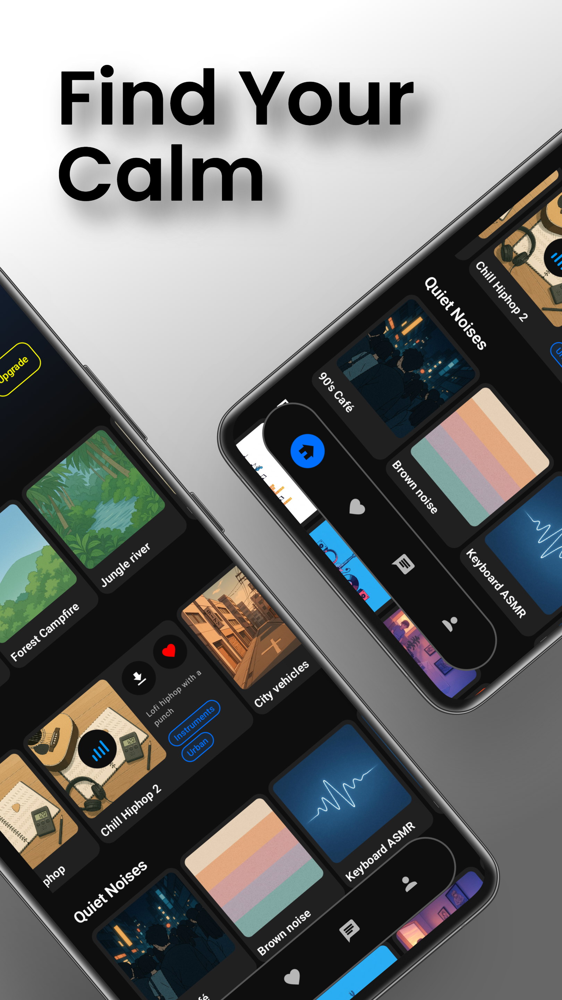
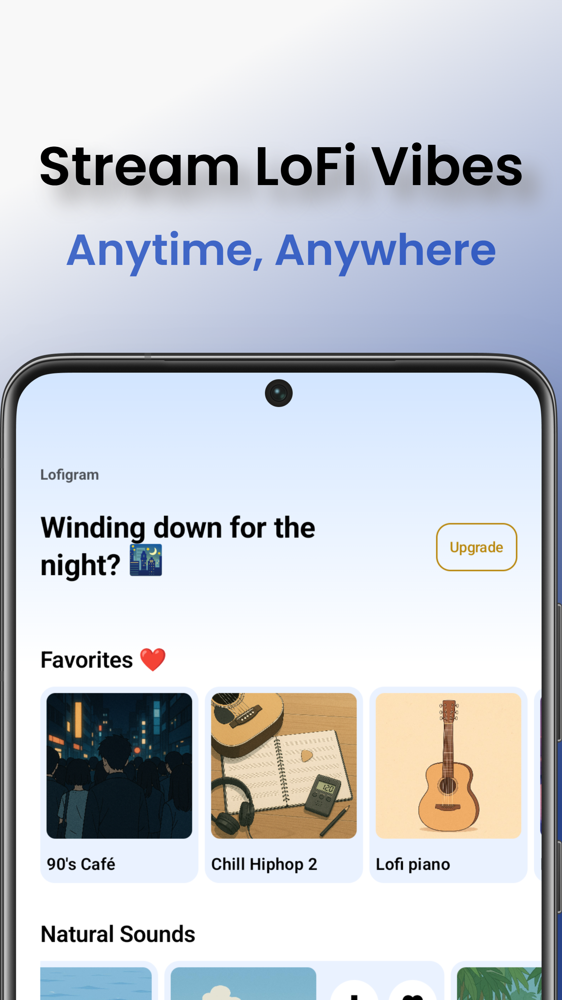
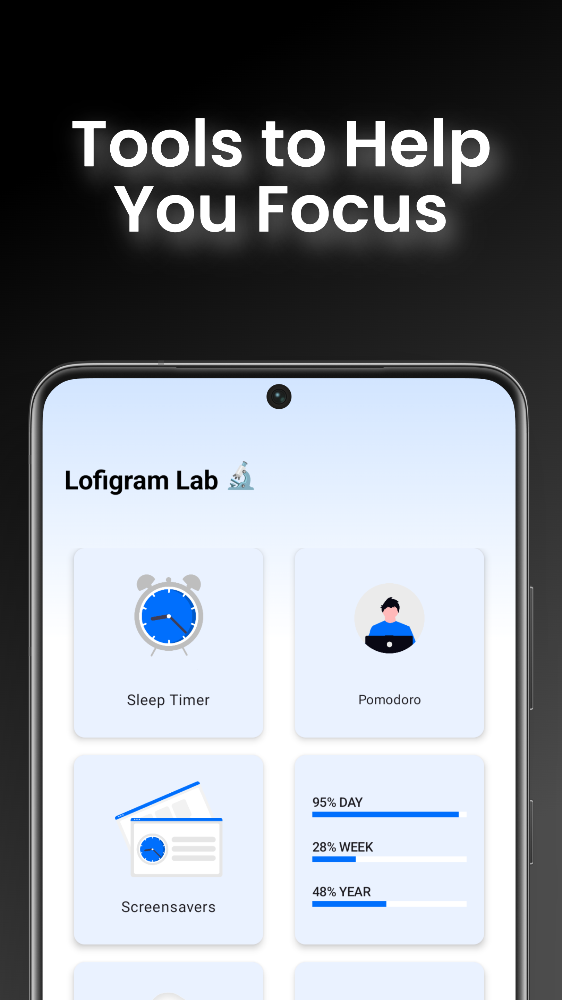
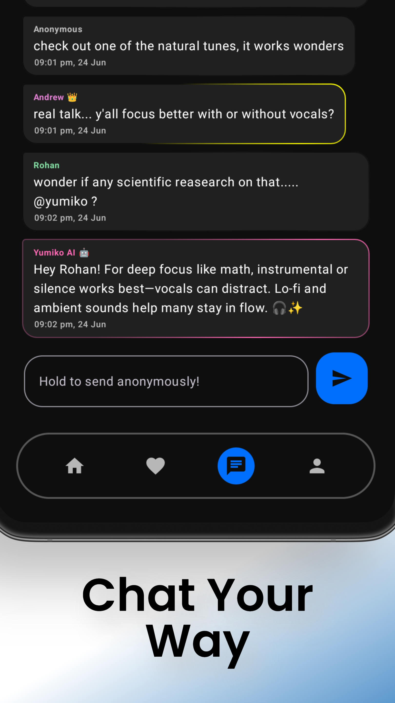
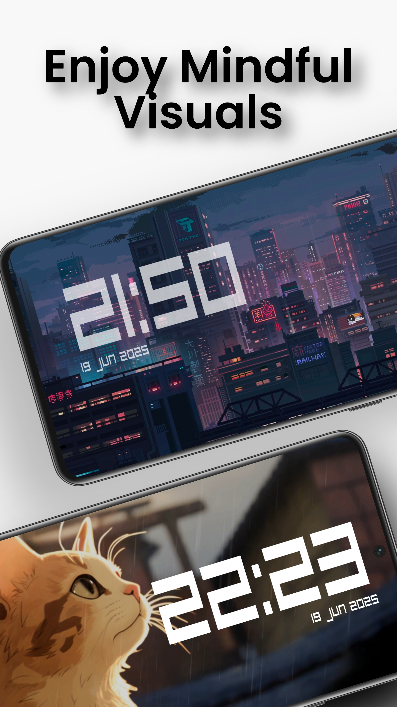

# Lofigram: Your Calm Space

Lofigram is a serene and mindful Android app designed to help you relax, focus, and connect with others. It combines lofi music, Pomodoro timers, a global chat, and much more — all wrapped in a calm and minimal UI.

---

## 📱 Download on Google Play

## 🌟 Features

- 🎵 **Lofi Music Streaming** (nature sounds, anime lofi, gaming lofi, etc.)
- ❤️ **Favorites & Personalized Music Categories**
- ⏱️ **Pomodoro Timer** with reminders
- 💤 **Sleep Timer** for music playback
- 💬 **Global Chat** with anonymous mode
- 🧘‍♀️ **Screensaver Mode** for mindful image viewing
- 📥 **Offline Downloads** (Premium & Trial)
- 🔗 **Fun Web Shortcuts**: websites like richup.io, scribbl.io, neal.fun, chess.com etc
- ✨ **Track Request Feature** for user suggestions
- 🔒 In-app purchases with premium & trial access

---

## 📸 Screenshots

| Home | Music Categories | Tools |
|------|------------------|-----------|
|  |  |  |

| Global Chat | Screensavers | Premium |
|-------------|----------|------|
|  |  |  |

---

## 🚀 Getting Started

### Prerequisites
- Android Studio (Giraffe+ recommended)
- Firebase project setup (Authentication, Realtime Database, Storage, etc.)
- Kotlin 1.9+, Jetpack Compose

### Setup Instructions
- Add your google-services.json to the app/ folder.
- Configure Firebase rules and enable login providers.
- Add your own keystore for signing release builds (do not commit it).
- Optional: Configure billing and AdMob if you're testing monetization.

### Tech Stack: Kotlin + Jetpack Compose
- Firebase (Auth, Realtime Database, Storage, Functions)
- ExoPlayer for screensavers
- In-app Billing (Play Store)
- AdMob for monetization
- Local caching and MediaPlayer

### Developers
Built by:
- Prudam Priyosanga Dutta ([Psydrite01](https://github.com/Psydrite01))
- Biprangshu Das ([jarvis1704](https://github.com/jarvis1704))

🎓 Indie developers from India
📬 Contact: psydriteofficial@gmail.com
